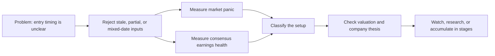

# Panic / Consensus Earnings Health Sentiment Engine

A two-gauge research screen for a buyside workflow.

## The portfolio problem

The project started with two practical questions:

1. When should I begin buying a company I already want to own?
2. How do I avoid mistaking a popular stock near peak optimism for a good entry?

The engine does not forecast the next price, call the exact top, or automate a trade.
Its narrower job is to separate market stress from earnings damage, reject noisy data,
and identify moments that deserve deeper portfolio research.



The sequence matters. A high Panic score is not a buy signal. Healthy earnings are not
a timing signal. The useful case is a large gap between price stress and still-resilient
earnings expectations, followed by a separate valuation and business-quality review.

- **Panic Meter**: measures crowd stress using market levels, ratios, breadth,
  correlation, and credit-spread velocity
- **Consensus Earnings Health**: measures direct forward-EPS revision health and breadth.
  The public schema retains the field name `fundamentals` for compatibility.
- **Dislocation Gap**: `Consensus Earnings Health + Panic - 100`. The public field remains
  `fundamental_discrepancy`. Positive means market stress exceeds the damage visible in
  earnings estimates.
- **Candidate Dislocation**: Panic of at least 75 plus Consensus Earnings Health
  of at least 60. This is a research flag only, never an allocation instruction.
- **Watch**: Panic from 67 to 75, or Panic above 75 with mixed earnings evidence.
  It prepares the research list without pretending the final trigger has arrived.
- **Entry diagnostics**: valuation and 3M EPS-versus-price divergence, reported
  separately so they cannot turn strong fundamentals into a bad reading.

Scopes: `sp500`, `ndx100`, and `mag7` (equal-weight Magnificent Seven basket).

## Quick start

```bash
pip install -r requirements.txt
export FRED_API_KEY=your_free_key   # https://fred.stlouisfed.org/docs/api/api_key.html

# 1. Build 10y of history (one-time, ~10-20 min)
python -m backtest.build_history

# 2. Run the legacy proxy-overlay backtest
python -m backtest.run_backtest

# 3. Daily scoring -> writes data/scores.json and appends data/timeline.json
python -m pipeline.run_daily
```

## Methodology (short version)

1. Panic components are converted to percentiles versus up to five trailing years.
   Publication requires at least one year because some official source histories are shorter.
2. Credit stress uses the velocity of its 10-day change. The other Panic inputs
   use their stated level, ratio, breadth, correlation, or term-structure measure.
3. The Consensus Earnings Health revision trend combines 30D, 60D, and 90D next-year EPS
   revisions at 50%, 30%, and 20%. Moves inside +/-0.25% are neutral.
4. A zero revision maps to 50. A weighted revision of +5% maps to 100, and
   -5% maps to 0. The result is clipped to the 0-100 range.
5. The final Consensus Earnings Health score is 60% revision magnitude and 40%
   market-cap-proxy-weighted revision breadth. Neutral breadth receives half credit.
   Mag7 uses equal weights.
6. Consensus Earnings Health at 60 or higher is healthy, 40 to 60 is mixed, and 40 or
   lower is deteriorating. A reading requires one common 30D/60D/90D cohort,
   at least five trends, 70% of the targeted cohort, and 40% of full-scope proxy weight.
7. Watch begins at Panic 67. Candidate Dislocation requires Panic of at least 75
   and Consensus Earnings Health of at least 60. High Panic with mixed earnings
   evidence stays Watch rather than crossing a hard 75-point cliff.
8. Valuation and EPS-versus-price divergence remain entry diagnostics only.
   The engine does not turn any screen into a buy, sell, sizing, or timing action.

## How the logic was written

The model follows six rules:

1. **Bad data cannot become conviction.** Publication stops when a constituent panel is
   too thin, a component is stale, or market and analyst observations use different dates.
2. **Normalize before combining.** Inputs with different units are translated into a
   comparable 0 to 100 scale against their own history.
3. **Separate emotion from business reality.** Panic and earnings revisions stay in
   different gauges so falling prices cannot manufacture a healthy fundamental score.
4. **Keep weights fixed at publication time.** Missing components do not receive silent
   reweighting, and related volatility measures are capped to prevent double counting.
5. **Use states, not false precision.** Normal, Watch, Candidate Dislocation, and
   earnings-deterioration states are more honest than claiming a score of 74 can predict
   a different future than a score of 75.
6. **Leave the final decision to portfolio research.** The output narrows attention.
   Valuation, moat, catalysts, position size, and staged accumulation remain human decisions.

This is intentionally not a perfect forecasting system. It is an auditable research filter
designed to reduce bad entry decisions, not a claim that every dislocation will recover.

## Component map

**Panic Meter**, launch weights:
| Component | Weight | Source |
|---|---|---|
| VIX term structure inversion (VIX9D/VIX3M, depth x duration) | 25% | Cboe official daily closes |
| Credit spread velocity (10d z-score, HY OAS) | 22% | FRED BAMLH0A0HYM2 |
| VVIX percentile | 20% | Yahoo ^VVIX |
| Breadth washout (% constituents above 200D) | 18% | Yahoo constituent prices |
| Aggregate equity put/call ratio | 15% | CBOE daily stats |

NDX scope substitutes VXN/VIX ratio for term structure (no VXN9D exists).
Mag7 substitutes downside-only pairwise correlation for breadth and uses an equal-weight
price and forward-EPS basket across NVDA, AAPL, MSFT, GOOGL, AMZN, META, and TSLA.
Correlation during a rising basket is neutralized so a healthy broad rally does not
masquerade as panic.

| NDX / Mag7 component | NDX weight | Mag7 weight |
|---|---:|---:|
| VXN / VIX ratio | 15% | 15% |
| VXN level | 15% | 15% |
| Credit-spread velocity | 25% | 25% |
| Breadth washout / downside correlation | 25% | 25% |
| Equity put/call | 20% | 20% |

VXN-derived inputs are limited to 30% combined. This prevents one technology
volatility theme from dominating the score through two closely related measures.

**Consensus Earnings Health**:
| Component | Weight | Source |
|---|---:|---|
| Weighted 30D/60D/90D next-year EPS revisions | 60% | Yahoo constituent analyst trends |
| 30D upward-revision breadth | 40% | Yahoo constituent analyst trends |

**Entry diagnostics**, excluded from Consensus Earnings Health:
| Diagnostic | Meaning | Source |
|---|---|---|
| Forward and trailing P/E | Absolute valuation context | Yahoo constituent estimates |
| Equity risk premium | Forward earnings yield less 10Y Treasury yield | Yahoo + FRED DGS10 |
| 3M EPS-price divergence | Estimate change less price return | Yahoo + prices |

## Historical validation boundaries

- The historical study is a legacy proxy-overlay study. It does not test the
  live Consensus Earnings Health formula.
- Shiller realized earnings are delayed by three months before use, but the
  downloaded series is still current-vintage and revision-prone.
- Constituent histories use today's membership backfilled through time. Because
  that introduces survivorship bias, this dataset is hard-blocked from promoting
  production weights even if a statistical comparison screen passes.
- Forward returns begin at the next available close, one session after a signal,
  and run for 63 trading sessions.
- Training excludes every signal whose forward-return label reaches 2022. The
  2022-present validation period therefore stays outside the optimizer.
- One 63-session window counts as one independent research entry. Promotion
  statistics require at least 10 independent entries and 90% block-bootstrap
  confidence versus both equal weights and current production.
- The generated candidate remains exploratory. It is not a live weight change or
  an allocation instruction.

## Data Timeline

`data/timeline.json` stores the public score history produced by the hardened
live methodology. It starts with the first real post-upgrade reading and grows
prospectively, with one reading per scope and market date. It never backfills
Consensus Earnings Health from Shiller earnings, the legacy proxy overlay, or
other historical substitutes. See `WEBSITE_DATA_CONTRACT.md` for schema details.

## Honest limitations (read before showing a PM)

1. **Consensus Earnings Health is prospective and unvalidated.** Free point-in-time
   constituent revision history is unavailable. The existing backtest studies a legacy
   Shiller-based entry overlay and must not be presented as validation of the live score.
2. **Index weights are approximate.** The full current constituent universe is ranked
   by a market-cap proxy first. Valuation calls are capped at the top 100 and analyst
   trends at the top 30 from that ranked universe. Reported coverage is the proxy weight
   captured by a common 30D/60D/90D cohort, not successful calls divided by attempted calls.
   These are not official float-adjusted index weights. Mag7 uses all seven companies
   and equal weights.
3. **Missing or stale inputs are not evidence.** A score must pass current-data and
   coverage requirements. It must not silently become a different model by reweighting
   only the components that happened to arrive.
   Broad constituent prices and market-cap proxies require at least 90% name coverage;
   Mag7 prices require all seven names. Market, EPS, and constituent membership dates
   and hashes must align before either public file is replaced.
4. **Entry-history sources are not mixed.** Older full-index S&P consensus snapshots
   are excluded from the live sample-based divergence count. The 3M divergence appears
   only after 64 comparable daily endpoints exist.
5. **ICE HY OAS history is now truncated.** FRED notes that `BAMLH0A0HYM2` is limited
   to three years starting in April 2026. Live scoring still uses that HY OAS series,
   while the historical fit uses the complete daily FRED `BAA10Y` credit-spread proxy.

## Repo layout

```
config.py              tickers, scopes, launch weights, constants
pipeline/fetchers.py   all raw data pulls (Yahoo, FRED, CBOE, Wikipedia constituents)
pipeline/components.py component math (term structure, velocity, breadth, ERP...)
pipeline/scoring.py    percentile engine, meter aggregation, quadrant + verdict
pipeline/run_daily.py  daily entrypoint -> scores.json + prospective timeline.json
pipeline/public_output.py strict public schema, privacy checks, atomic safe writer
index.html              public website structure and investment methodology
app.js                  website data binding, map logic, and schema self-check
styles.css              responsive visual system and motion
backtest/build_history.py  10y raw series -> data/history.parquet
backtest/run_backtest.py   legacy historical proxy-overlay research
.github/workflows/daily.yml  free daily cron (GitHub Actions)
.github/workflows/pages.yml  validated GitHub Pages publication
.github/workflows/ci.yml     pull-request model, contract, and website checks
```

Website reads and publication must follow `WEBSITE_DATA_CONTRACT.md`. The public
surface is fixed, scheduled static market data only. It is not an API proxy,
contains no creator profile or credentials, and exposes no browser-triggered
refresh workflow.

`data/weights_candidate.json` is legacy research output, not an instruction to
the live Consensus Earnings Health score or to a portfolio.
